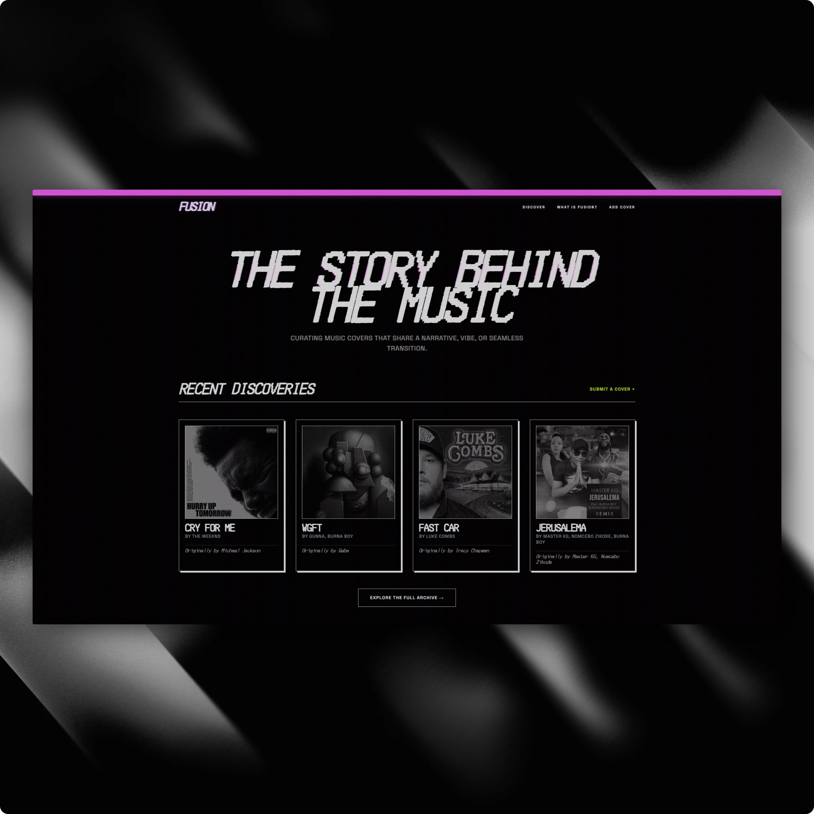

# Fusion



Fusion is a discovery platform designed for music lovers to find the "story behind the music." It curates and showcases music covers that share a common narrative, vibe, or seamless transition, leveraging the Spotify API to analyze musical DNA (energy, danceability, valence).

## Features

- **Narrative Discovery**: Browse a curated feed of music covers with deep-dive stories on why they work.
- **Musical Insights**: Visualize audio features (Tempo, Energy, Valence) to compare the "Vibe Shift" between originals and covers.
- **Zine-Inspired Aesthetic**: A high-contrast, premium UI featuring CRT scanline overlays, neon accents, and bold typography.
- **Direct Spotify Integration**: 
    - Search for any track on Spotify.
    - Paste Spotify links/IDs directly to auto-select tracks.
    - Preview tracks directly within the app's custom music player.
- **Community Contributions**: Share your own cover discoveries with tags and detailed narrative descriptions.

## Tech Stack

- **Framework**: SvelteKit (Svelte 5 Runes)
- **Runtime**: Node + Bun
- **Database**: PostgreSQL (hosted on Neon)
- **ORM**: DrizzleORM
- **Styling**: Tailwind CSS
- **API**: Spotify Web SDK
- **Forms**: SvelteKit Superforms & Zod

## Getting Started

### Prerequisites

- Bun installed.
- A Spotify Developer account for API credentials.
- A Neon Postgres database instance.

### Installation

1. **Clone the repository:**
   ```bash
   git clone https://github.com/ibrahimraimi/fusion.git
   cd fusion
   ```

2. **Install dependencies:**
   ```bash
   bun install
   ```

3. **Set up environment variables:**
   Create a `.env` file in the root directory and add the following:
   ```env
   DATABASE_URL=your_postgres_url
   SPOTIFY_CLIENT_ID=your_client_id
   SPOTIFY_CLIENT_SECRET=your_client_secret
   ```

4. **Initialize the database:**
   ```bash
   bun db:push
   ```

5. **Start the development server:**
   ```bash
   bun dev
   ```

## Design Philosophy

Fusion is built with a zine-inspired, high-contrast aesthetic. It prioritizes:
- **Visual Excellence**: Bold colors (Neon Green, Pink) against a deep black background.
- **Premium Micro-interactions**: Smooth hover transitions, interactive audio feature charts, and a vinyl-inspired custom player.
- **Dynamic Feedback**: Instant UI feedback via toast notifications and loading states.

## Contributing

We welcome contributions. Whether it's adding new musical examples, improving the vibe shift algorithm, or refining the UI.

---

Built by [Metro](https://x.com/ibrahimraimi_), inspired by [Ausify](https://ausify.com.au).